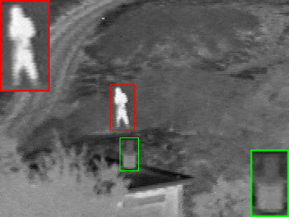

# PIAFusion_pytorch
该项目为**非官方**的“PIAFusion: A progressive infrared and visible image fusion network based on illumination aware” pytorch版本实现，由[linklist2](https://github.com/linklist2)完成。

作者实现的版本为Tensorflow 1.x版本实现，链接：**[PIAFusion](https://github.com/Linfeng-Tang/PIAFusion)**.

本项目在win10 1080Ti 和 Ubuntu 20.04 3090上都进行了测试，还未发现任何bug。

值得注意的是，作者实现的Tensorflow版本中的损失函数以及CMDAF与论文中描述略有出入，本项目则选择与论文保持一致。

非常感谢作者在代码调试期间提供的帮助。

## 最近更新

 - 更新论文中图片对比时画中画效果， 在后面会有介绍。效果如下：
  
   

## 推荐安装的环境(在win10 1080Ti中的虚拟环境)

 - torch 1.9.0 
 - tqdm 4.64.0  
 - numpy 1.22.4
 - opencv-python 4.5.5.64

更详细的信息可以参考 ```requirements.txt```,注意其中的包并非需要全部安装，请酌情安装。

## 训练

 ### 1. 将 data_illum.h5 文件转换为图片格式

训练光照感知子网络的h5文件数据集在[data_illum.h5](https://pan.baidu.com/s/19Xbg3bWcMo600zZe7exnVg?pwd=PIAF).

下载之后，在项目中新建```datasets``` 文件夹，并将data_illum.h5文件移入其中。

为了更好地观看训练的图片以及方便书写和调试代码， 本项目选择将h5文件还原为png格式的图片，使用下列命令转换：

```shell
python trans_illum_data.py --h5_path 'datasets/data_illum.h5' --cls_root_path 'datasets/cls_dataset'
```
转换后的目录如下所示:
```shell
 cls_dataset/
 ├── day
 │   ├── day_0.png
 │   ├── day_1.png
 │   ├── ......
 ├── night
 │   ├── night_0.png
 │   ├── night_1.png
 │   ├── ......
```

 ### 2. 将 data_MSRS.h5 文件转换为图片格式

训练融合网络所需的数据集链接：[data_MSRS.h5](https://pan.baidu.com/s/1cO_wn2DOpiKLjHPaM1xZYQ?pwd=PIAF).

使用下列命令转换为图片格式:
```shell
python trans_msrs_data.py --h5_path 'datasets/data_MSRS.h5' --msrs_root_path 'datasets/msrs_train'
```

转换后的目录如下所示:
```shell
 msrs_train/
 ├── Inf
 │   ├── 0.png
 │   ├── 1.png
 │   ├── ......
 ├── Vis
 │   ├── 0.png
 │   ├── 1.png
 │   ├── ......
```

如果上述提供的链接失效了，也可以在[此链接](https://pan.baidu.com/s/18XjhLlzr_t9Y1sDYudJHww?pwd=u1tt) 中下载上述两个文件.


### 3. 训练光照感知子网络

光照感知子网络（二分类网络）的训练命令如下：
```shell
python train_illum_cls.py --dataset_path 'datasets/cls_dataset' --epochs 100 --save_path 'pretrained' --batch_size 128 --lr 0.001
```
训练后得到最佳测试准确率的模型权重保存在[pretrained/best_cls.pth](https://github.com/linklist2/PIAFusion_pytorch/blob/master/pretrained/best_cls.pth), 准确率大约为 98%.

### 4. 训练融合网络
```shell
python train_fusion_model.py --dataset_path 'datasets/msrs_train' --epochs 30 --cls_pretrained 'pretrained/best_cls.pth' --batch_size 128 --lr 0.001 --loss_weight '[3, 7, 50]' --save_path 'pretrained'
```
**loss_weight** 对应的数值分别为 **loss_illum**, **loss_aux**, **gradinet_loss** 三个损失的系数.

**cls_pretrained** 则为上一步训练得到的最佳模型权重文件。


## 测试
### 1. MSRS数据集
```shell
python test_fusion_model.py --h5_path 'test_data/MSRS' --save_path 'results/fusion' --fusion_pretrained 'pretrained/fusion_model_epoch_29.pth'
```

测试结果即融合图像可以在 ```save_path``` 对应的路径中找到.

该项目仅供pytorch学习者参考，实际效果可能与作者实现的tensorflow版本有出入。

**注意: 测试的数据集需要与训练的数据集的目录结构相同，如下所示：**:

```shell
 MSRS/
 ├── Inf
 │   ├── 00537D.png
 │   ├── ......
 ├── Vis
 │   ├── 00537D.png
 │   ├── ......
```

## 画中画效果

请修改utils/plotRegionZoom.py中如下关键信息使用；
```shell
    region_list = [
        [137, 105, 167, 161],
        [149, 171, 172, 212]
    ]

    zoom_bool = [True, True]

    color_list = ['red', 'green']
    line_list = [1, 1]
    scale_list = [2, 2]
    place_list = ['top left', 'upper right']
    plotMultiRegion('39.bmp', region_list=region_list, line_width_list=line_list, color_list=color_list,
                    place_list=place_list, scale_list=scale_list, save_path='multiregion.bmp', zoom_bool=zoom_bool)
```

其中region_list表示需要框选的区域的坐标信息列表；zoom_bool表示是否将框选的区域放大；place_list表示将放大的区域放置在原图中的何处；
color_list表示框的颜色；line_list表示框的线条宽度；scale_list表示框选的区域放大的倍数；39.bmp替换成自己的图片路径；multiregion.bmp换成自己想要保存的路径；

# 待做

由于时间原因，还未测试其它数据集的适配情况，请自行测试。

 - [ ] Test The RoadScene Dataset
 - [ ] Test The TNO Dataset  
 - [ ] Adjust the loss factor parameter
 - [ ] Modify the loss function


## 结尾：

如果您觉得该论文对你有帮助，请使用以下格式引用：
```
@article{Tang2022PIAFusion,
  title={PIAFusion: A progressive infrared and visible image fusion network based on illumination aware},
  author={Tang, Linfeng and Yuan, Jiteng and Zhang, Hao and Jiang, Xingyu and Ma, Jiayi},
  journal={Information Fusion},
  volume = {83-84},
  pages = {79-92},
  year = {2022},
  issn = {1566-2535},
  publisher={Elsevier}
}
```

如果您觉得该pytorch项目对您有帮助，请点击star。
